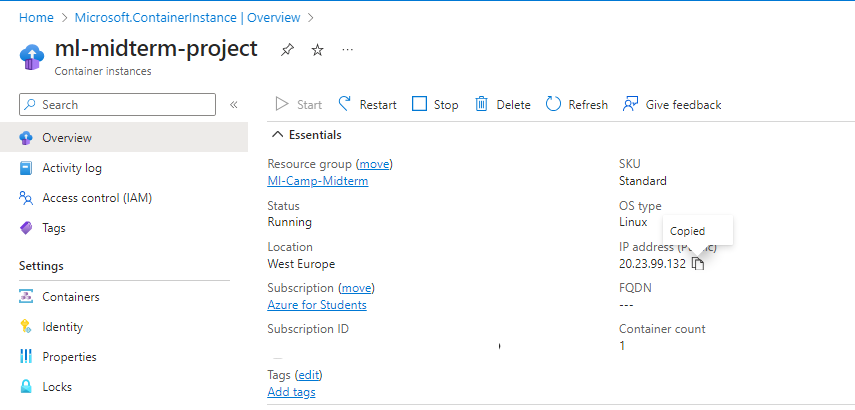

# ML midterm project for course

This is the midterm project for [ML Zoomcamp 2023](https://github.com/DataTalksClub/machine-learning-zoomcamp). Thanks a lot Alexey Grigorev and the rest of the team and community for such a great opportunity!

## The idea behind the project

In most universities and colleges, scholarship holders lose their scholarship if their cumulative GPA falls below 3.00. It is fairly easy to know if one will lose their scholarship depending on their grades, but what if we didn't have access to that info, and instead we predicted if one's GPA will be below 3.00 based on their personal details and behavior.  

We'll be predicting whether students' cumulative GPAs (In a university in Cyprus) would allow them to keep their scholarship (As in they're greater than 3.00) depending on their behavior, high school type and other variables that do not include grades. Our problem is binary classification. We'll go through the data and try out a couple models

## The dataset

The used dataset can be downloaded easily from [Kaggle](https://www.kaggle.com/datasets/joebeachcapital/students-performance/data). Although, we'll be removing some features here because they're not helpful for our model's goal.

The features to be removed are the 'GRADE' and 'Expected Cumulative grade point average in the graduation (/4.00)'. Additionally, since scholarships are kept if your cumulative GPA doesn't go lower than 3 in most universities, we'll transform 'Cumulative grade point average in the last semester (/4.00)' to a binary variable. 1 if it's greater than 3.00, 0 if not.

Lastly, after some data cleaning and EDA, we can finally look into training models.

## The models

We'll train a logistic regression model, decision tree model, and then a random forest model.

We compare their accuracies and AUC ROC scores after tuning parameters, then we pick the best (and most stable), extract it to a script, then host it in a docker container through a light flask project.

## Pipenv, Our virtual environment

If you want to copy the environment used here, you can just copy the requirements.txt file and use VS Code to create it like this:


Or you could copy `pipfile.lock` to a directory and use `pipenv sync` while in it (as in, it's the active directory in your terminal).

## Docker

To run the docker container we must first build it. Everything related to the Docker is in the folder `Deployment`. With the running directory in the terminal being that (and the Docker Engine active and running), we can easily build the container with:

```Bash
docker build -t scholarship-predict .
```

Then we run it with:

```Bash
docker run -it -p 9696:9696 scholarship-predict
```

At this point you can try running the test.py file and you'll get a return!

## Cloud

We can host this container with Azure in what's called "Azure Container Instances". These can easily allow us to deploy a docker container and expose it to the internet so we can use it with a post request.

Since Azure wasn't covered in the zoomcamp, I'll be going through things in more detail. I hope that doesn't bore you!

I'll be using the GUI on the official website, but you can do this with code if you want ([Here](https://learn.microsoft.com/en-us/azure/container-instances/container-instances-tutorial-prepare-app)'s the documentation). We both follow the same steps anyway (Plus, we'll still be using some code).

### Step 1: Creating a resource group

Using the create button on top, filling the form, we can see a resource group named "ml-camp-midterm"


### Step 2: Creating a container registry (where our containers will be saved)


We validate then create it.

Let's save our login server, we'll need it for later.


Next, we'll need Azure CLI locally on our computer. We'll login with:

```Bash
az login
az acr login --name mlcontainercamp
```

Login to the container registry is successful:


(We type our password after the first login, in our case the registry is public so it doesn't need a password)

We log on our registry using Docker, with the auto generated admin credentials below:


Assuming our image is already running, we create a tag with:

```Bash
docker tag scholarship-predict mlcontainercamp.azurecr.io/scholarship-predict:v2
```

Keep in mind `scholarship-predict`is our image's name, `v2` is just a version specification that could be anything, but it's best to be a meaningful addition. And `mlcontainercamp.azurecr.io` is our registry.

Now we have to push the image (which resulted from the tag) to the repo. Which is done with:

```Bash
docker push mlcontainercamp.azurecr.io/scholarship-predict:v2
```


As we can see, it is working! All to do now is wait.

For the last step, we can run this image on a VM, an Azure Image Container or an Azure Container App. As previously stated, we'll choose an Image Container due to its simplicity considering our needs are just for a test (And it's also cheap).

### Step 3: Creating a container instance

We check our repo that we just pushed, in the menu below we can see a "Run instance button"


The button leads us to the following form:


After filling it _and making sure it has access to the internet & the port is changed to "9696" since that's the host port we set up_, we click on Create, and wait for the deployment to be done.

When it is done, we come back to see the public IP to call with our test file.

For this case it's `20.23.99.132`.



We edit our URL in our test.py script.


It works!

Because I'm on a limit budget I deleted the entire resource group, as shown below:


