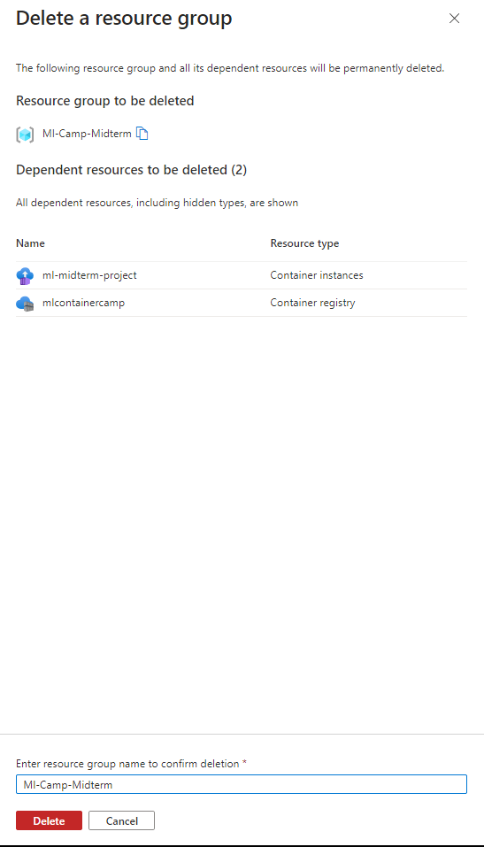

# ML midterm project for course

## The idea behind the project

In most universities and colleges, scholarship holders lose their scholarship if their cumulative GPA falls below 3.00. It is fairly easy to know if one will lose their scholarship depending on their grades, but what if we didn't have access to that info, and instead we predicted if one's GPA will be below 3.00 based on their personal details and behavior.  

We'll be predicting whether students' cumulative GPAs (In a university in Cyprus) would allow them to keep their scholarship (As in they're greater than 3.00) depending on their behavior, high school type and other variables that do not include grades. Our problem is binary classification. We'll go through the data and try out a couple models

## The dataset

Data can be downloaded easily from [Kaggle](https://www.kaggle.com/datasets/joebeachcapital/students-performance/data). Although, we'll be removing some features here because they're not helpful for our model's goal.

The features to be removed are the 'GRADE' and 'Expected Cumulative grade point average in the graduation (/4.00)'. Additionally, since scholarships are kept if your cumulative GPA doesn't go lower than 3 in most universities, we'll transform 'Cumulative grade point average in the last semester (/4.00)' to a binary variable. 1 if it's greater than 3.00, 0 if not.

Lastly, after some data cleaning and EDA, we can finally look into training models.

## The models

We'll train a logistic regression model, a decision tree model, then a random forest model.

We compare their accuracies and AUC ROC scores, then pick the best, extract it to a script, then host it in a docker container that has a light flask project.

## Docker

To run the docker container we must first build it. Everything related to the Docker is in the folder `Deployment`. With the running directory in the terminal being that (and the Docker Engine active and running), we can easily build the container with:

```Bash
docker build -t scholarship-predict .
```

Then we run it with:

```Bash
docker run -it -p 9696:9696 scholarship-predict
```

At this point you can try running the test.py file and you'll get a return!

## Cloud

We can host this container with Azure in what's called "Azure Container Instances". These can easily allow us to deploy a docker container and expose it to the internet so we can use it with a post request.

I'll be using the GUI on the official website, but you can do this with code if you want ([Here](https://learn.microsoft.com/en-us/azure/container-instances/container-instances-tutorial-prepare-app)'s the documentation). We both follow the same steps anyway.

Step 1: Creating a resource group


Step 2: Creating a container registry (where our containers will be saved)


We validate then create it.

Next, we'll need Azure CLI locally on our computer. We'll login with:

```Bash
az login
az acr login --name mlcontainercamp
```

(We type our password after the first login, in our case the registry is public so it doesn't need a password)

We log on our registry using Docker, with the auto generated admin credentials below:


Then we pull, tag then push our image:

```Bash
docker pull mcr.microsoft.com/mcr/scholarship-predict
docker tag mcr.microsoft.com/mcr/scholarship-predict mlcontainercamp/samples/scholarship-predict
docker push mlcontainercamp/samples/scholarship-predict
```

Step 3: Creating a container instance



In the creation form we select our registry and our image that we pushed, Azure automatically suggests the smallest size that fits it. By default it'll have access to the internet by the public.

We validate and create, then we come back to see the public IP to call with our test file.

We test the IP to check if everything is working as expected:

In our case it was 4.175.161.104.

We change our test script, and it works!


Because I'm on a limit budget I deleted the entire resource group.

## Pipenv

If you want to copy the environment used here, you can just copythe requirements.txt file and use VS Code to create it like this:


Or you could copy `pipfile.lock` to a directory and use `pipenv sync` while in it (as in, it's the active directory in your terminal).
